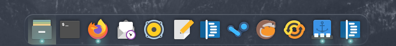
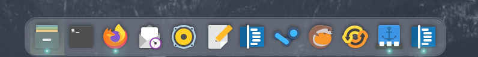
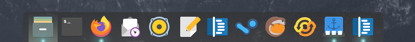
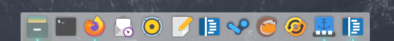
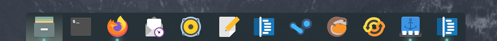

# Well it's been quite a while  
I am reworking these themes based on the updated elementary stylesheet as well as creating more based on some of my favorite GTK3 themes.  

## Changelog
* 1-Aug-2020 initial commit.  Added a shadow to anti-shade and changed color to match elementary os 5 a bit better (hopefully) / Added install script I yoinked from another repository

* 6-Aug-2020 Added Nordic and Nordic light. Nordic uses the Nordic color palette as it's base color while Nordic Light is a lighter color to contrast against the Nordic palette.  Both themes also have a more rounded border, highlights and icon shadows to (hopefully) help with readability.  I'm not a designer, i'm doing my best.  Create an issue with suggestions.  Also I am starting work on a graphical tool to modify plank themes, I am still a beginner so no ETA as of yet.

* 20-Nov-2020 Added Y-ru theme (based on yaru)

* 30-Jun-2021 Plank doesn't work under wayland so I don't feel any need to update or create any more themes.
---

## TODO
* Change padding of the themes

## Personal notes
I have zero idea why this repository randomly gets attention from time to time but thats cool.  Im always thinking of different themes I can create
but plank only has so many options so it's tough.

---
### Screenshots

#### Nordic

#### Nordic Light

#### Shade

#### Anti-Shade

#### Paperterial

#### Y-ru

